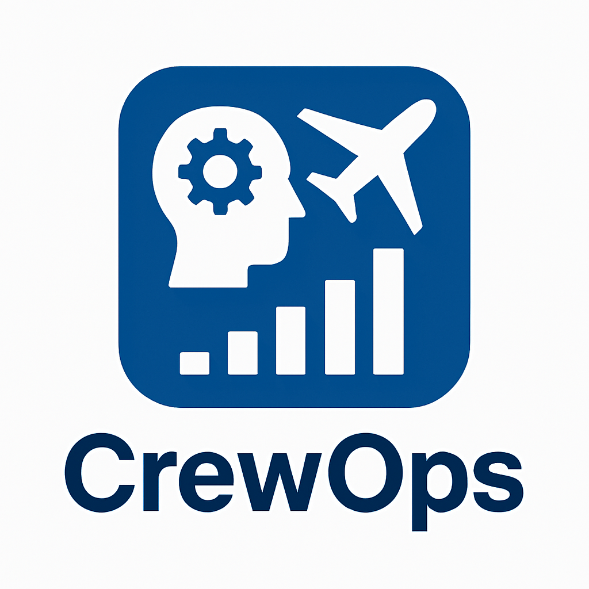

# Crew Ops: Airline Crew Optimization Dashboard

**Built by [Vikrant Thenge](https://www.linkedin.com/in/vthenge)** 

CrewOps helps airline ops teams assign crew to flights while respecting duty limits, rest periods, and availability windows. It simulates real-world constraints and visualizes crew schedules with clarity.

---

## 🚀 Live App  

---

## 📸 Logo  

---

## 📊 Key Features

- 🧠 Intelligent crew assignment logic  
- ⚠️ Violation detection for overlapping shifts  
- 📈 Gantt-style visualization of crew schedules  
- 📊 KPI cards for utilization and compliance  
- 📉 Charts for crew coverage, role balance, and compliance trends  
- 📥 Downloadable assignment summary  
- 🧪 Sample data auto-loaded for demo users

---

## 📁 Sample Data Included

- `sample_flight_schedule.csv`  
- `sample_crew_pool.csv`  

These files auto-load if no uploads are provided — perfect for recruiters or demo users.

---

## 🧪 Tech Stack

- `Streamlit`  
- `Pandas`  
- `Plotly`  
- `Python 3.9+`
